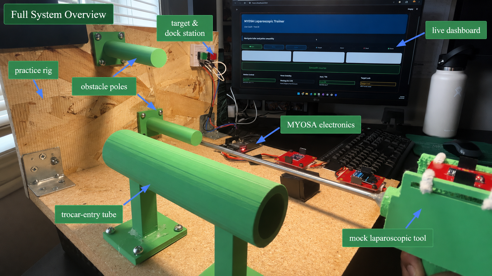
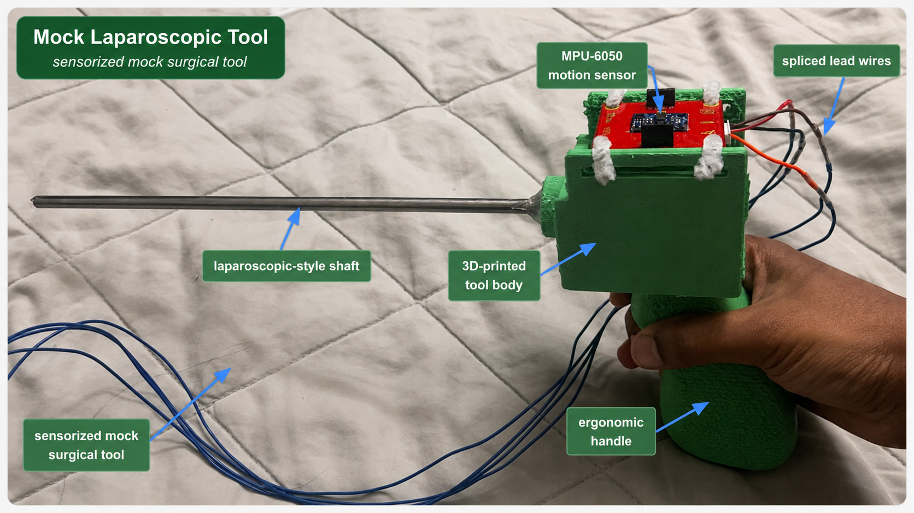
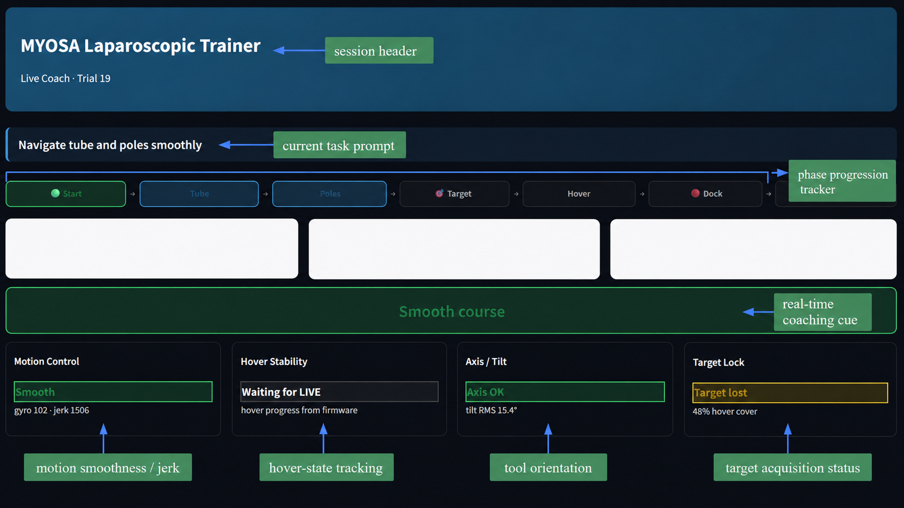
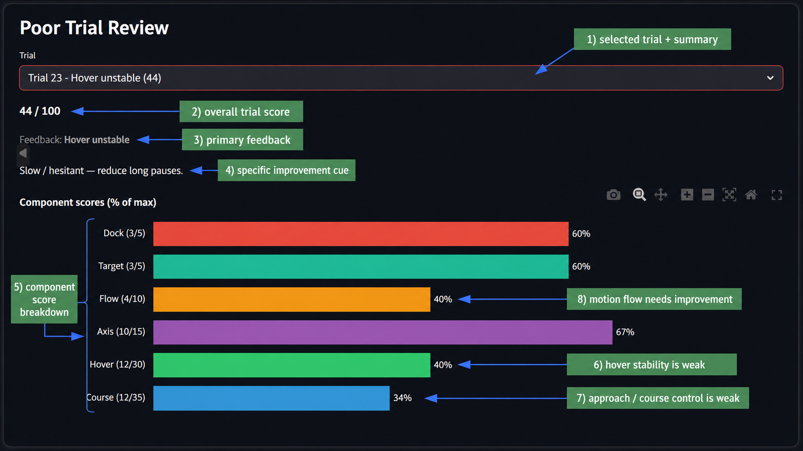
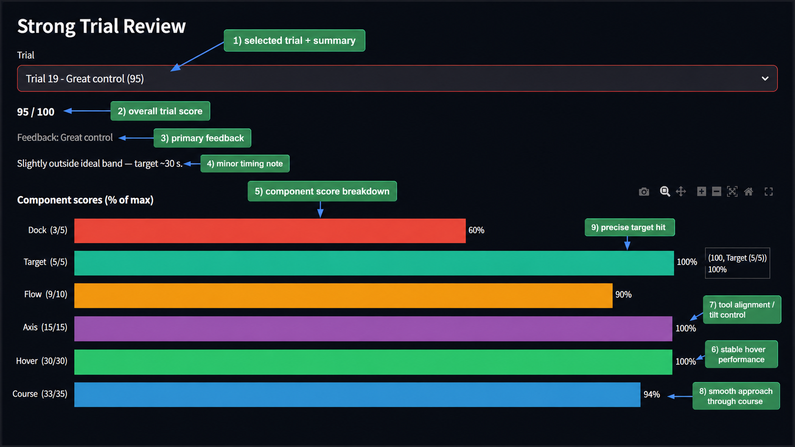

> The physical course tests the hands. MYOSA explains the technique.

---

## Acknowledgements

We would like to thank the MYOSA team for providing the hardware platform, documentation, and opportunity to build a sensor-based biomedical engineering prototype. We also acknowledge the surgical simulation and laparoscopic training community, whose work on objective skills assessment inspired the structure of this project.

---

## Overview

Laparoscopic surgery requires precise control of long instruments through small entry points while the operator watches a camera view on a screen. This makes skills like smooth motion, depth control, steadiness, target accuracy, and timing especially important.

Practice trainers are useful because they let trainees repeat these motions in a safe setting. However, many low-cost box trainers mostly show whether a task was completed. They often do not provide immediate, objective feedback on how the user moved. Higher-fidelity simulators can provide richer assessment, but they may be expensive, less portable, or less accessible for frequent early-stage practice.

**Precision in Practice** is a MYOSA-based laparoscopic skills trainer designed to close that feedback gap. It combines a physical task course, a mock laparoscopic tool, MYOSA sensors, embedded firmware, an OLED display, and a laptop dashboard to turn each practice attempt into measurable feedback.

The system evaluates three simplified laparoscopic skills:

1. **Approach:** controlled movement through a constrained path
2. **Hover:** stable positioning over a target zone
3. **Target completion:** precise final docking on a red target button

These skills were chosen based on the same general ideas used in laparoscopic skills assessment: efficiency, precision, instrument control, and motion smoothness. For this proof-of-concept, we simplified those ideas into tasks that could be measured using the sensors available in the MYOSA kit.

**Key features:**

- Physical laparoscopic-style task course
- Mock laparoscopic tool with mounted MPU6050 IMU
- IMU-based motion smoothness and axis-control scoring
- APDS9960 light-sensor target-zone hover detection
- OLED display for immediate phase guidance and coaching cues
- Streamlit dashboard for live coaching, trial review, and progress tracking
- Phase-specific scoring for course control, hover precision, axis discipline, flow, target control, and docking

---

## Demo / Examples

### Images

<p align="center">
  <br/>
  <i>Annotated full-system overview showing the practice rig, trocar-entry tube, obstacle poles, MYOSA electronics, live dashboard, target/dock station, and mock laparoscopic tool.</i>
</p>

<p align="center">
  <br/>
  <i>Sensorized mock laparoscopic tool with ergonomic 3D-printed handle, laparoscopic-style shaft, MPU6050 motion sensor, and spliced lead wires.</i>
</p>

<p align="center">
  <br/>
  <i>Live coaching dashboard with phase progression, task prompt, real-time coaching cue, motion smoothness, hover tracking, tool orientation, and target lock status.</i>
</p>

<p align="center">
  <br/>
  <i>Poor trial review showing low course and hover scores, unstable hover feedback, and specific improvement cues.</i>
</p>

<p align="center">
  <br/>
  <i>Strong trial review showing high component scores, stable hover performance, strong axis control, and smooth approach through the course.</i>
</p>

### Videos

<video controls width="100%">
  <source src="myosa-lap-trainer-demo.mp4" type="video/mp4">
</video>

---

## Features (Detailed)

### 1. Physical Laparoscopic Task Course

The trainer is built around a simplified laparoscopic task sequence. The goal is not to recreate surgery directly, but to isolate measurable hand-control skills that are important in laparoscopic training.

The task has three main evaluation stages:

**Approach**

The user guides the tip of the mock laparoscopic tool through a long tube that represents entering through a trocar port. The tool is then retracted and navigated over and under two poles. This stage tests controlled movement through a constrained path.

**Stable Hover**

After clearing the approach stage, the user picks up an object and holds it over the APDS9960 light sensor for two seconds. This stage tests steadiness and target-zone control.

**Precise Target Completion**

The user replaces the object onto the board and completes the trial by pressing the red target button. This stage confirms the final docking action and ends the trial.

The physical course creates the challenge. The MYOSA sensors measure how the user performs it.

---

### 2. Mock Laparoscopic Tool

The mock tool uses a long shaft to mimic the basic form factor of laparoscopic instruments, where motion at the handle affects the position of a distal tip. The handle is designed to be ergonomic so the user can focus on controlled movement rather than awkward grip mechanics.

An MPU6050 IMU is mounted on the tool and connected to the MYOSA board through an extended spliced wire. This lets the tool move freely through the course while continuously streaming motion data back to the controller.

The tool is intentionally simple. It is not a clinical instrument. It is a proof-of-concept interface for evaluating motion quality during a laparoscopic-style training task.

---

### 3. MYOSA Sensor Integration

The project uses multiple MYOSA-compatible modules together in one real-time system.

**MPU6050 IMU**

The MPU6050 provides acceleration and gyroscope data. The firmware uses these signals to estimate motion smoothness, rotation, jerk, and axis control.

The gyroscope values are combined into one total rotational-motion metric:

```plaintext
gyro_mag = sqrt(gx^2 + gy^2 + gz^2)
```

High gyro magnitude means the tool is rotating or wobbling more.

The firmware also calculates a simple jerk proxy:

```plaintext
acc_mag = sqrt(ax^2 + ay^2 + az^2)
jerk_proxy = abs(acc_mag - previous_acc_mag) / dt
```

Smooth motion changes gradually. Jerky motion creates spikes. This lets the trainer detect abrupt movements and provide feedback such as “slow down” or “hold steady.”

**APDS9960 Light Sensor**

The APDS9960 is used in ambient-light mode. During the hover stage, the object/tool covers the sensor and causes the clear-light channel to drop. The firmware uses this drop as target-zone detection.

In this prototype, the APDS9960 is not used as a precise distance sensor. It is used as a target-lock indicator: when the sensor is covered, the system knows the user has reached the hover zone.

**OLED Display**

The OLED provides immediate local feedback. It shows the current phase, hover progress, and simple coaching cues.

Examples include:

```plaintext
Smooth course
Slow down
Hold steady
Cover target
Gentle press
```

**Buttons**

The green button starts the trial. The red button completes the docking phase and returns the system to idle after the trial.

---

### 4. Firmware State Machine

The embedded firmware is organized around a state machine:

```plaintext
IDLE → APPROACH → HOVER → DOCK → COMPLETE
```

**IDLE**

The system waits for the green start button. The OLED shows the previous score and prompts the user to begin.

**APPROACH**

The user moves through the tube and pole course. The firmware tracks motion smoothness, jerk, rotation, timing, and axis control.

**HOVER**

The APDS9960 detects when the target is covered. The hover timer starts only when the target is covered and the IMU reports stable motion. If the target is lost or the tool becomes too jerky, hover progress pauses or resets.

**DOCK**

After completing the hover, the user presses the red target button. The system evaluates docking timing and harshness.

**COMPLETE**

The final score is frozen and displayed. The dashboard receives the final trial summary and adds it to the session history.

---

### 5. Phase-Specific Scoring

The final score is out of 100 points and is broken down by skill category:

```plaintext
Course /35
Hover /30
Axis /15
Flow /10
Target /5
Dock /5
```

The goal is not only to ask, “Did the user finish?” The goal is to ask:

```plaintext
How did they move?
Where did control break down?
What should they improve next?
```

**Course /35**

Course scoring evaluates the approach phase. It uses gyro RMS, jerk RMS, spike rate, pauses, and approach time. The system does not reward zero motion because the user has to move through the course. It rewards controlled motion: smooth, deliberate movement with fewer abrupt spikes.

**Hover /30**

Hover scoring evaluates whether the user can hold the target steadily for two seconds. The hover timer only counts when the target is covered and the tool is stable. Hover resets, unstable movement, and lost target coverage reduce the score.

**Axis /15**

Axis scoring evaluates whether the handle stays close to a neutral orientation. The IMU estimates tool tilt using the accelerometer. This encourages the user to keep the tool aligned rather than drifting off-axis.

**Flow /10**

Flow scoring evaluates timing. A good trial should be controlled, not rushed and not hesitant.

**Target /5**

Target scoring evaluates APDS target coverage during the hover phase. It rewards consistent target-zone coverage.

**Dock /5**

Docking is intentionally weighted lightly. The red button confirms final target completion, and the system can lightly penalize a harsh or rushed final press.

---

### 6. Real-Time Feedback

The trainer provides feedback during the run, not only after it. This is important because users can immediately connect their movement with the system response.

Examples:

```plaintext
If jerk is high → "Slow down"
If hover is unstable → "Hold steady"
If APDS target is not covered → "Cover target"
If tool tilt is high → "Level handle"
If in dock phase → "Gentle press"
```

The OLED provides immediate feedback on the physical trainer, while the laptop dashboard provides a richer view of the same trial.

---

### 7. Streamlit Dashboard

The laptop dashboard is built in Streamlit and connects to the MYOSA board over USB serial. The firmware streams structured messages such as:

```plaintext
EVENT
LIVE
FINAL_SCORE
CAL_SET
THRESHOLDS
```

The dashboard parses these messages and displays them in a training-focused interface.

**Live Coach**

Shows the current phase, live score, trial number, phase progress, hover progress, and immediate feedback such as “slow down,” “level handle,” or “hold steady.”

**Trial Review**

Shows the final score, component breakdown, phase timing, what went well, and what to improve next.

**History**

Tracks scores over multiple trials in a training session. This makes improvement visible over time.

**Calibration / Tuning**

Allows calibration commands and threshold review during development.

**Debug**

Shows raw serial lines and parsed data for troubleshooting.

---

### 8. Technical Implementation

The embedded firmware is written in C++ using PlatformIO. It initializes the MYOSA sensor chain, reads IMU and APDS data, updates the state machine, calculates motion metrics, writes OLED feedback, and streams structured serial data to the dashboard.

The dashboard is written in Python using Streamlit, PySerial, Pandas, and Plotly. It reads the serial stream, parses trial events, updates the live coaching interface, stores completed trials, and visualizes training progress.

Key technical features include:

- Sensor-driven phase transitions
- Real-time IMU motion processing
- APDS ambient-light hover detection
- Button debouncing for start and dock events
- OLED phase guidance
- Structured serial protocol
- Live dashboard polling
- Trial history storage
- Calibration and tuning support

The MYOSA sensor modules integrated cleanly through I2C and serial communication. This made it possible to build a modular prototype where sensor input, firmware logic, OLED feedback, and laptop analytics all work together in real time.

---

### 9. CAD and Physical Design

The physical rig and mock tool were designed to support a repeatable training task.

The tool uses a long shaft to imitate the geometry of laparoscopic instruments, and the handle is shaped for stable grip and controlled movement. The course includes a tube entry feature, pole obstacles, a target zone, and a final docking button.

The CAD goal was not to recreate a full surgical simulator. It was to build a clean, repeatable physical interface that lets the MYOSA sensors evaluate meaningful movement patterns.

---

## Evaluation

We evaluated the prototype by comparing intentionally poor trials with smoother, more controlled trials.

In a poor trial, shaky motion produces higher jerk and rotation values. The trainer reflects this immediately through feedback such as “slow down” or “hold steady,” and the final score shows lower course and hover performance.

In a smoother trial, motion spikes are reduced, the APDS target remains covered, hover completes cleanly, and the final score improves.

This shows that the scoring system reflects meaningful differences in trial performance. It also shows why real-time feedback matters: the trainee can see the relationship between their movement and the trainer’s response during the task, not just afterward.

The History tab adds another layer of value by tracking performance across a training session. This supports a learning loop:

```plaintext
attempt → feedback → adjustment → repeat
```

---

## Usage Instructions

1. Connect the MYOSA board to the laptop over USB.
2. Build and upload the firmware using PlatformIO.
3. Close the PlatformIO serial monitor before opening the dashboard.
4. Launch the Streamlit dashboard.
5. Select the correct COM port at 115200 baud.
6. Press the green button to start a trial.
7. Move through the course: tube, poles, target hover, and red dock.
8. Review the final score and dashboard feedback.
9. Repeat trials and use the History tab to track progress.

The full firmware and dashboard code are included in the `code/myosa_lap_trainer/` folder. To run the system, open that folder as the PlatformIO project root.

---

## Tech Stack

- **MYOSA ESP32 motherboard**
- **MPU6050 IMU**
- **APDS9960 light/proximity/gesture sensor**
- **OLED display**
- **Push buttons**
- **C++ / Arduino framework**
- **PlatformIO**
- **Python**
- **Streamlit**
- **PySerial**
- **Pandas**
- **Plotly**
- **CAD / 3D printed components**

---

## Requirements / Installation

Run all commands from the project root folder. The project root is the folder that contains `platformio.ini`, `src/`, `lib/`, and `dashboard/`.

```plaintext
myosa_lap_trainer/
├─ platformio.ini
├─ src/
├─ lib/
└─ dashboard/
```

### Firmware

Build and upload the firmware with PlatformIO:

```bash
pio run
pio run -t upload
```

Optional serial monitor:

```bash
pio device monitor -b 115200
```

Close the serial monitor before using the dashboard. Only one program should use the serial port at a time.

If `pio` is not available globally, open the project folder in VS Code, use the PlatformIO extension, and run **Build** followed by **Upload**.

### Dashboard

Install the dashboard dependencies:

```bash
pip install -r dashboard/requirements.txt
```

Run the dashboard:

```bash
streamlit run dashboard/app.py
```

Then open the dashboard in the browser, select the correct COM port, and connect at `115200` baud.

### Dashboard Dependencies

The dashboard requires the Python packages listed in `dashboard/requirements.txt`:

```plaintext
streamlit
pyserial
pandas
plotly
```

---

## File Structure (Optional)

The submission folder contains the Markdown page, local demo media, and the full source code. All filenames are lowercase and contain no spaces. The images and video are placed in the same folder as this Markdown file.

```plaintext
myosa-laparoscopic-trainer/
├─ precision-in-practice-myosa-laparoscopic-trainer.md
├─ myosa-lap-trainer-demo.mp4
├─ myosa-lap-trainer-cover.png
├─ myosa-lap-trainer-tool.png
├─ myosa-lap-trainer-dashboard.png
├─ myosa-lap-trainer-poor-feedback.png
├─ myosa-lap-trainer-good-feedback.png
└─ code/
   └─ myosa_lap_trainer/
      ├─ platformio.ini
      ├─ src/
      │  └─ main.cpp
      ├─ lib/
      │  ├─ AccelAndGyro/
      │  ├─ LightProximityAndGesture/
      │  └─ oled/
      ├─ dashboard/
      │  ├─ app.py
      │  ├─ requirements.txt
      │  └─ README.md
      ├─ docs/
      │  └─ demo_video_context.md
      └─ README.md
```

The full firmware and dashboard source code are included under `code/myosa_lap_trainer/`. Generated build folders, cache folders, raw logs, and local dashboard data are intentionally excluded.

---

## Limitations

This is a proof-of-concept prototype, not a validated surgical simulator.

Current limitations include:

- No true 3D position tracking
- No direct collision sensing on the tube or poles
- APDS9960 detects target-zone occlusion, not precise distance
- IMU-based tilt can be affected by rapid acceleration
- Scoring thresholds require calibration for each physical setup
- Current feedback is rule-based rather than learned from expert-labeled trials

---

## Future Directions

Future versions could improve the trainer by adding:

- Contact sensors on the tube and poles for collision detection
- Extra APDS or light-gate checkpoints for phase detection
- Wireless logging through Bluetooth or WiFi
- User profiles and longitudinal training records
- More advanced CAD for interchangeable task modules
- Machine learning models trained on labeled good and poor trials
- More specific coaching, such as detecting rushing, hesitation, poor axis control, and unstable target acquisition
- Camera tracking for better path and position analysis

---

## Conclusion

Precision in Practice demonstrates how the MYOSA platform can turn a simple physical trainer into a real-time feedback system.

The physical course creates the challenge. The sensors measure the motion. The firmware interprets the trial. The dashboard turns the data into coaching.

The result is a low-cost, modular proof of concept for making laparoscopic skills practice more measurable, accessible, and feedback-rich.

---

## License (Optional)

This project is submitted for the MYOSA competition as an educational proof-of-concept prototype. Reuse should credit the original project team and follow any license requirements set by the official MYOSA repository.

---

## Contribution Notes (Optional)

Future contributors could extend the project by improving the CAD, adding collision sensors, refining the scoring thresholds, adding user profiles, or training machine-learning models on labeled trial data. Contributions should preserve the modular MYOSA sensor architecture and keep the dashboard feedback understandable for trainees.
